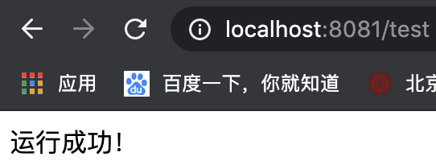

<p align="center"><a href="http://jveuzt.coding-pages.com/#/" target="_blank" rel="noopener noreferrer">
</p>
<p align="center">
  <a href="https://github.com/owlaser/owlaser-paclist/actions"></a>
  <a href="https://opensource.org/licenses/MIT"></a>
</p>

<h1 align="center">Owlaser</h1>

<p align="center">
开源组件健康扫描系统
</p>


## 项目介绍

OWLASER 是开源组件健康扫描系统的后端部分，项目要点如下：

- 后端采用springboot + mybatis + maven框架开发
- 上传pom.xml文件或者jar包扫描
- 获得项目下所有依赖信息，包括版本，license，和间接依赖等
- 获得所用依赖包的最热版本信息和最新稳定版本信息
- 获得项目下所用开源组件license的约束
- 得到最新的漏洞信息库(github和nvd)


## Demo

[OWLASER](http://jveuzt.coding-pages.com)

建议在本机部署进行扫描


## 功能

#### 版本优选

* 推荐开源组件使用人数最多的版本号
* 推荐开源组件最新稳定版本

#### License警告

* 开源组件所用license的约束(如不允许商用等)

#### 漏洞扫描

* github和nvd最新漏洞数据库，并随时更新
* 扫描项目下所有开源组件的漏洞警告


## 文档

[api](api.md)

[前端文档](https://github.com/owlaser/owlaser-ui/blob/master/README.md)


## 快速开始

1. 配置最小开发环境：

  * [MySQL](https://dev.mysql.com/downloads/mysql/)
  * [JDK1.8或以上](http://www.oracle.com/technetwork/java/javase/overview/index.html)
  * [Maven](https://maven.apache.org/download.cgi)
  * [IDEA](https://www.jetbrains.com/idea/)

2. 数据库依次导入owlaser-db/sql下的数据库文件

  * owlaser-scheme.sql
  * owlaser-tables.sql
  
3. 启动owlaser后端服务

   * 打开idea，导入paclist项目
   * 更改项目下src/main/resources/application.properties

   ```properties
   //将以下两项改为自己数据库的用户名和密码
   spring.datasource.username=root
   spring.datasource.password=root
   ```

   * 更改com.owlaser.paclist.component/SecurityDatabase

   ```java
   //37行，更改为自己的github token
           httpHeaders.put("Authorization","token XXXXXX");
   ```

   申请token具体看[官方文档](https://help.github.com/en/github/authenticating-to-github/creating-a-personal-access-token-for-the-command-line)

   * 右键PaclistApplication.java运行主类

   * 打开浏览器输入`localhost:8081/test`

   如果返回如下界面，则后端运行成功

   

   

4. 更新漏洞数据库(选做)

   将`//@Component`的注释去掉，重新跑一次PaclistApplication.java（注意要更改为自己的github token）

   若看到以下结果，则更新完成

   

5. 运行前端，具体请看[前端文档](https://github.com/owlaser/owlaser-ui/blob/master/README.md)

   

## 项目展示


## 贡献

欢迎贡献您的代码或者讨论您的好点子！

欢迎所有pull request和issue

感谢所有帮助我们构建Owlaser的贡献者


## LICENSE

[**MIT**](https://opensource.org/licenses/MIT)